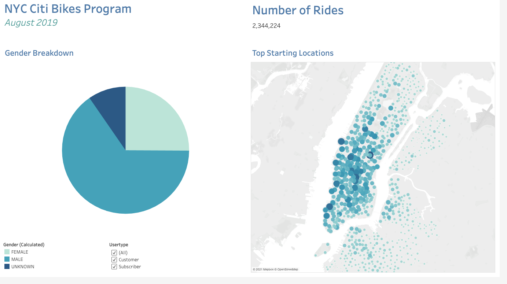
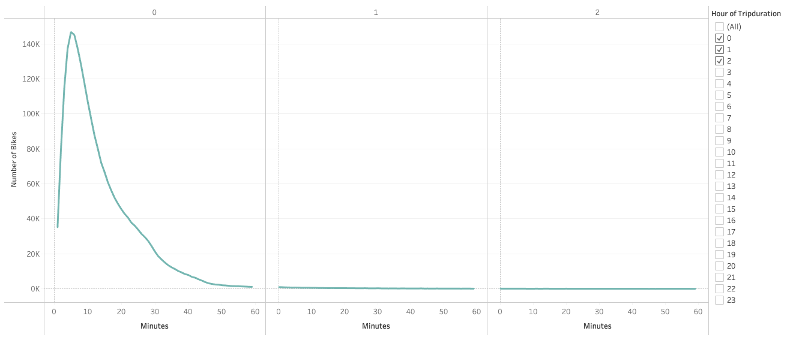
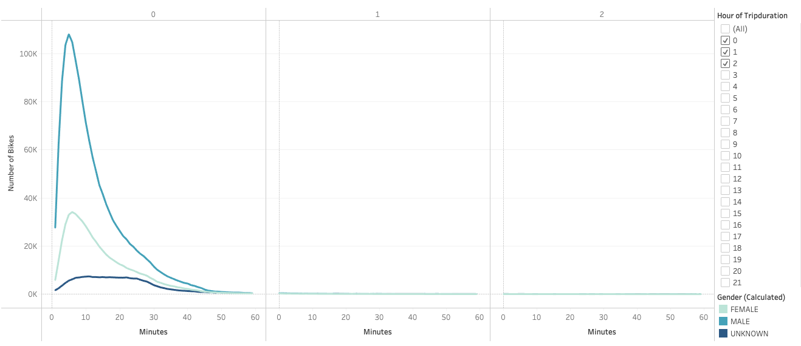
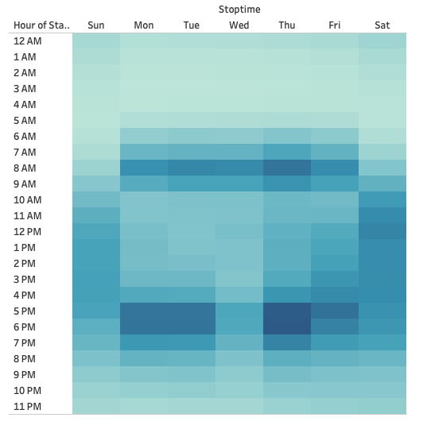
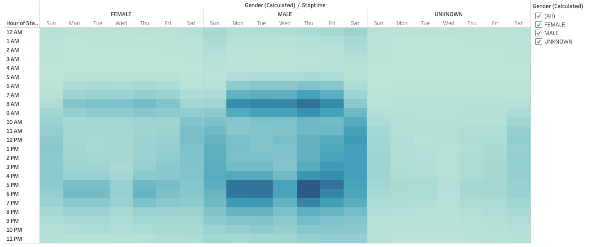
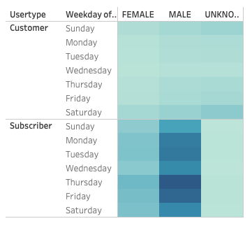
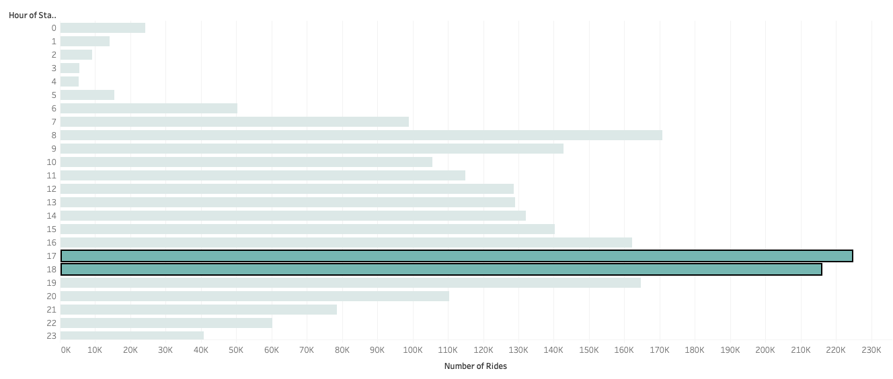
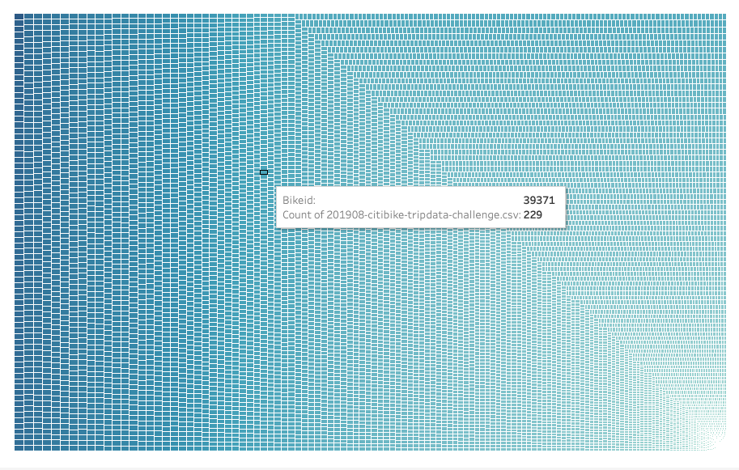

# Bikesharing

## Overview of Project
This project will use Tableau to visualize data for the New York City Citi Bike Program for August 2019. This information will be used to inform future decisions around a potential bike-sharing program in Des Moines, Iowa. 

### Purpose
These visualizations and resulting visualizations will help to provide an idea of the use of bike-sharing in New York City and whether the program is feasible when scaled up or down for a differing city. A variety of visualizations are shared via Tableau as a part of the NYC Citi Bike Story.

To start, a dashboard displays the basic demographics and summary of the NYC Citi Bikes Program such as the total number of rides, the gender breakdown and the top starting locations for rides. This gives users a snapshot or starting point when delving deeper into the analysis.

## Results
#### NYC Citi Bike Demographics
*2,344,224 rides in August 2019, 1,530,272 male riders, 588,431 female riders, 225,521 unknown gender riders and the top starting locations for bike rides.*

Following this, a number of other visualizations provide the user an idea of the NYC Citi Bikes Program details.

#### Checkout Times for Users
*Riders mostly used Citi Bikes within the 1H trip duration time, ridership drastically decreased after the 1H mark. The number of bikes in use decreased as the trip duration increased. This suggests that bikes are the preferred method of transport only for shorter distances.*

#### Checkout Times by Gender
*Male riders account for more than half of the ridership, 73.7% of riders are male at the most popular bike ride duration. The trip duration for all riders follow a similar pattern, with shorter trips being the norm.*

#### Trips by Weekday per Hour
*Citi Bike users mostly used the service in the morning hours, evenings, and weekends. This implies that users may use the service to commute to work as ridership numbers drop during 9AM – 5PM, which are usual operating hours for a lot of workplaces. Rides seem somewhat evenly distributed during the weekends.

#### Trips by Gender (Weekday per Hour)
*Male and female riders have similar patterns of use for the Citi Bike Program. The heatmap reinforces the fact that males have higher levels of use than females. For those of unknow genders, it can be inferred that they are infrequent users who did not provide their demographic information. Their usage shows less of a pattern and slightly more than average use on weekends.*

#### User Trips by Gender by Weekday
*A large portion of Citi Bike riders are subscribers. The level of use is relatively evenly distributed throughout the days of the week for male and female subscribers. For single-use riders, the level of use increases slightly on weekends.*

#### August Peak Hours
*5PM and 6PM are the two most popular times for the bike-sharing program in August in NYC.*

#### Bike Repairs
*The treemap shows the number of rides per each bike registered to the program. This will give an indication of which bikes are the most frequently used and therefore may require more or frequent maintenance. Bike ID#38124 has 479 rides! Users can interact with the visualization to view the number of rides per bike.*

## Summary
The complete visualization for the NYC Citi Bike Program can be found [here](https://public.tableau.com/profile/lydia.zhang8767#!/vizhome/NYCCitiBikeProgramAugust2019/NYCCitiBike).

In summary, these visualizations helped to determine that:
* A total of 2,344,224 rides took place in August 2019 in NYC through the Citi Bike Program.
* The highest number of bikes checked-out by all users happened at 0H 5MINS. The majority of bike rides lasted less than 1 hour in duration.
* Riders used the service in the mornings and evenings on weekdays and throughout the weekends.
* More than half of the riders were male but male and female riders have similar ride patterns for time and day of rides.
* Ridership peaked during the hours of 5PM and 6PM in August.
* The most used bike in the program had 497 rides in total.

To improve on these visualizations and analysis, it is recommended that the bike trips be mapped against weather data for the time period in question. Since bike riding is easily limited by adverse weather conditions such as rain and snow, it will be important for those considering a bike-sharing program to understand the impact of weather on usage.

In addition, it may be useful to expand the analysis to another month of the year, another season, or for an entire calendar year. It would be interesting to contrast the data from August (summer) with a month opposite in the year such as December or February.